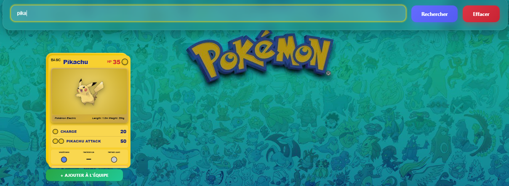
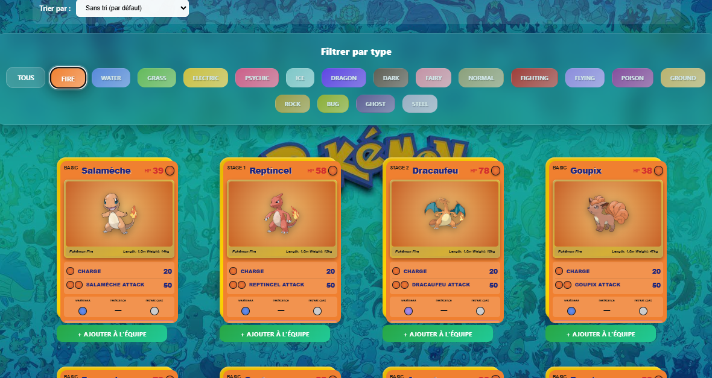
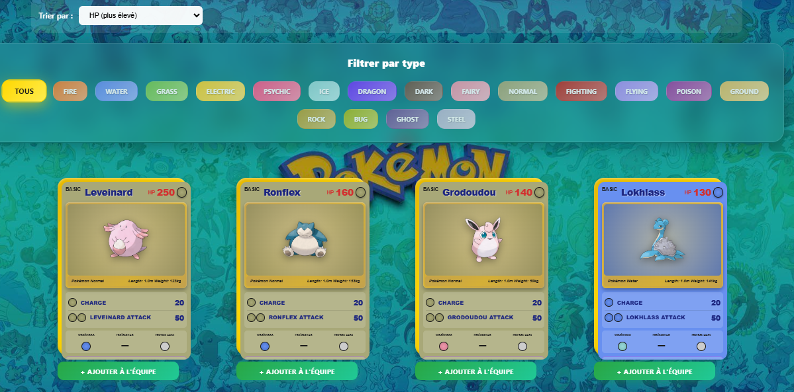
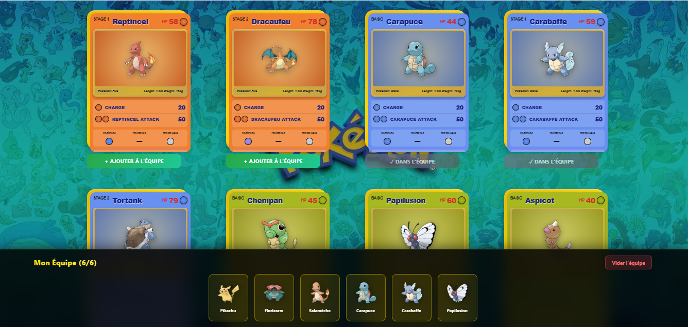
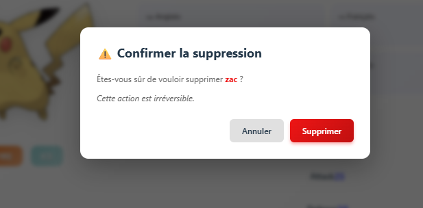

# Pokédex de Theo

##  Présentation Vidéo

**Voici ma vidéo YouTube pour la présentation de mon site en musique :D**

-> [Voir la vidéo](https://youtu.be/3O3obRPqAds)

---


##  Fonctionnalités Bonus
- **Barre de recherche** : Recherche de Pokémon par nom dans toutes les langues
  
- **Filtre par type** : Filtrage client-side par type sur tous les Pokémons 
  
- **Filtre par HP/stats** : Filtrage client-side par HP ou les stats des Pokémons
  
- **Creation d'une équipe pokemon** : Création d'une équipe de 6 Pokémons
  - 6 slots visuels
  - Miniatures des Pokémon
  - Bouton de retrait par Pokémon
  - Bouton pour vider toute l'équipe
  - Compteur (ex: "Mon Équipe (3/6)")
  
- **Effet hover sur les cartes** : Quand on passe sur une carte elle bouge
- **Notifications** : Feedback visuel lors de l'ajout (succès/erreur)
  
- **Création de Pokémon**
  - Formulaire complet : Création de nouveaux Pokémon personnalisés
  - Upload d'image : Possibilité d'ajouter une image
  - Validation : Vérification des données saisies


###  Page d'Accueil

- **Affichage des Pokémon** : Grille responsive de cartes Pokémon (4 par ligne sur desktop)
- **Cartes réalistes** : Design inspiré des cartes Pokémon TCG Base Set avec :
  - Bordure dorée permanente
  - Couleurs par type (18 types différents)
  - Informations complètes (HP, stage d'évolution, attaques, faiblesse, résistance)
  - Effet 3D au survol avec rotation
  - Dimensions authentiques (ratio 5:7)

###  Recherche et Filtrage

- **Barre de recherche** : Recherche de Pokémon par nom 
- **Filtre par type** : Filtrage client-side par type de Pokémon
- **Pagination** : Navigation entre les pages (20 Pokémon par page)
- **Compteur de résultats** : Affichage du nombre de Pokémon trouvés

###  Team Builder (Gestion d'Équipe)

- **Ajout à l'équipe** : Bouton sur chaque carte pour ajouter un Pokémon
- **Limite de 6 Pokémon** : Respect de la règle des jeux Pokémon
- **Barre persistante** : Affichage permanent en bas de l'écran avec :
  - 6 slots visuels
  - Miniatures des Pokémon
  - Bouton de retrait par Pokémon
  - Bouton pour vider toute l'équipe
  - Compteur (ex: "Mon Équipe (3/6)")
- **Notifications** : Feedback visuel lors de l'ajout (succès/erreur)
- **Persistance** : Sauvegarde automatique dans LocalStorage
- **Protection contre les doublons** : Impossible d'ajouter deux fois le même Pokémon

###  Page Détails

- **Fiche complète** : Affichage détaillé d'un Pokémon individuel
- **Navigation** : Retour à la liste facilité

###  Création de Pokémon

- **Formulaire complet** : Création de nouveaux Pokémon personnalisés
- **Upload d'image** : Possibilité d'ajouter une image
- **Validation** : Vérification des données saisies

###  Interface Moderne

- **Design glassmorphism** : Effets de flou et transparence
- **Background personnalisé** : Image de fond immersive
- **Animations fluides** : Transitions et effets visuels


---

##  Prérequis

Avant de commencer, assurez-vous d'avoir installé :

- **Node.js** (version 16 ou supérieure)
- **npm** ou **yarn**
- **Git**

---

## Installation

### 1. Cloner le repository

```bash
git clone https://github.com/votre-username/tp-partie-front-Theo-Dominguez.git
cd tp-partie-front-Theo-Dominguez
```

### 2. Installer les dépendances

```bash
npm install
```

### 3. Configurer le backend

 **Important** : Ce projet nécessite un backend fonctionnel.

Assurez-vous que le backend est lancé sur `http://localhost:3000` avec les endpoints suivants :

- `GET /api/pokemons?page={page}` - Liste paginée des Pokémon
- `GET /api/pokemons/search/:name` - Recherche par nom
- `GET /api/pokemons/:id` - Détails d'un Pokémon
- `POST /api/pokemons` - Création d'un Pokémon
- `PUT /api/pokemons/:id` - Modification d'un Pokémon
- `DELETE /api/pokemons/:id` - Suppression d'un Pokémon

Le backend doit également servir les images des Pokémon via `/assets/pokemons/`

```bash
git clone https://github.com/votre-username/tp-partie-back-Theo-Dominguez.git
cd tp-partie-back-Theo-Dominguez
```
---

##  Lancement de l'Application

### Mode Développement

```bash
npm run dev
```

L'application sera accessible sur `http://localhost:5173`

### Build de Production

```bash
npm run build
```

Les fichiers optimisés seront générés dans le dossier `dist/`

### Prévisualisation du Build

```bash
npm run preview
```

---

##  Structure du Projet

```
tp-partie-front-Theo-Dominguez/
├── public/                  # Fichiers statiques
├── src/
│   ├── components/         # Composants réutilisables
│   │   ├── DeleteModal.jsx
│   │   ├── Loader.jsx
│   │   ├── Pagination.jsx
│   │   ├── PokemonCard.jsx
│   │   ├── PokemonForm.jsx
│   │   ├── PokemonList.jsx
│   │   ├── PokemonForm.jsx
│   │   ├── PokemonList.jsx
│   │   ├── SearchBar.jsx
│   │   ├── TeamBar.jsx      # Barre d'équipe persistante
│   │   ├── TypeFilter.jsx
│   │   └── *.css            # Styles des composants
│   ├── contexts/           # Gestion d'état globale
│   │   └── TeamContext.jsx  # Context pour le Team Builder
│   ├── pages/              # Pages de l'application
│   │   ├── Home.jsx
│   │   ├── PokemonDetail.jsx
│   │   ├── CreatePokemon.jsx
│   │   └── *.css
│   ├── services/           # Services API
│   │   └── pokemonService.js
│   ├── styles/             # Styles globaux
│   │   ├── PokemonCard.css
│   │   ├── PokemonList.css
│   │   └── types.css
│   ├── App.jsx             # Composant racine
│   ├── App.css
│   ├── main.jsx            # Point d'entrée
│   └── index.css
├── package.json
├── vite.config.js
└── README.md
```


### Background

L'image de fond est servie par le backend : `http://localhost:3000/assets/pokemons/fond.jpg`

Pour changer le fond, remplacez ce fichier dans le backend.

---


##  Auteur

**Theo Dominguez**

---


**Bon jeu sur le Pokédex Theo !**
